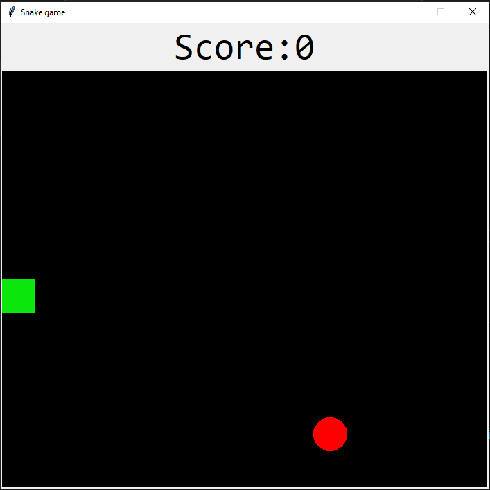
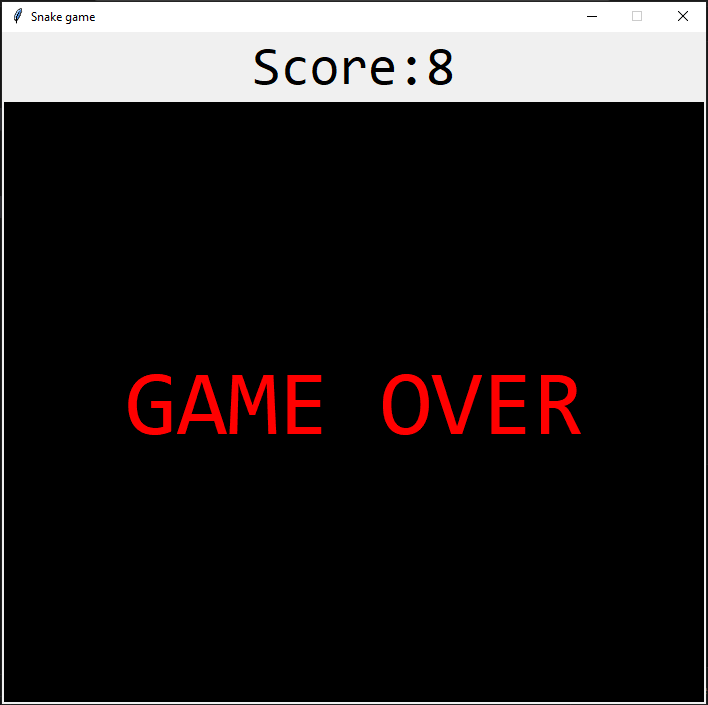

# 🐍 PROJECT TITLE:
# Classic Snake Game using Python & Tkinter

---

## 1. Overview of the Project
This is a fun, classic **Snake Game** built using **Python** and its standard GUI library, **Tkinter**. The goal is simple: control the snake to eat the red food, making the snake grow longer, while avoiding collisions with the boundaries (walls) and the snake's own body.

This project is excellent for beginners, showcasing fundamental game development concepts like:
* Game loops (the `next_turn` function).
* GUI rendering and updates.
* Basic collision detection logic.

---

## 2. Features
* **Classic Gameplay:** Experience the traditional Snake game mechanics.
* **Smooth Controls:** Responsive movement using the **arrow keys**.
* **Real-time Scoring:** The score updates immediately as the snake consumes food.
* **Random Food Spawning:** Food appears randomly within the game grid.
* **Collision Detection:** The game ends if the snake hits a wall or its own tail.
* **Game Over Screen:** A clear "GAME OVER" message appears upon losing.
* **Customizable:** Easily adjust game constants like speed, size, and colors.

---

## 3. Technologies / Tools Used
* **Python 3.x:** The core programming language.
* **Tkinter:** Python's standard library for creating the graphical user interface (GUI).
* **`random` module:** Used for generating random coordinates for the food.

---

## 4. Steps to Install & Run the Project
### ⚙️ Installation
Since the project uses only Python and Tkinter (which comes bundled with standard Python distributions), there are no extra libraries to install.

1.  **Ensure Python is Installed:** Verify that you have Python 3.x installed on your system.
2.  **Save the Code:** Create a new file (e.g., in your text editor or IDE) and name it **`snake_game.py`**.
3.  **Paste the Source Code:** Copy the provided Python code into the `snake_game.py` file.

### ▶️ How to Run
1.  **Open your terminal or command prompt.**
2.  **Navigate** to the directory where you saved `snake_game.py`.
3.  **Execute the file** using the Python interpreter:
    ```bash
    python snake_game.py
    ```
4.  A game window will pop up. Use the **arrow keys** to start moving and playing!

---

## 5. Instructions for Testing
Use the following checks to verify the game's functionality:

* **Movement:** Confirm the snake moves correctly using the $\uparrow, \downarrow, \leftarrow, \rightarrow$ keys.
* **Growth and Scoring:** Check that the snake grows by **one segment** and the score increases by **one point** every time it eats the red food.
* **Food Reset:** Ensure a new red food item appears in a random location immediately after the previous one is eaten.
* **Wall Collision:** Test moving the snake head beyond the boundaries (left, right, top, bottom) to confirm the **"GAME OVER"** screen appears.
* **Self Collision:** Play long enough to check that hitting the snake's own body segments also triggers the **"GAME OVER"** screen.

---

## Screenshots (Optional but Recommended)
For a complete documentation set, consider adding images showing:
* The game start screen (score 0, initial snake position).
      
* A frame showing the snake eating the food (a key gameplay moment).

* The final **"GAME OVER"** screen displaying the final score.

